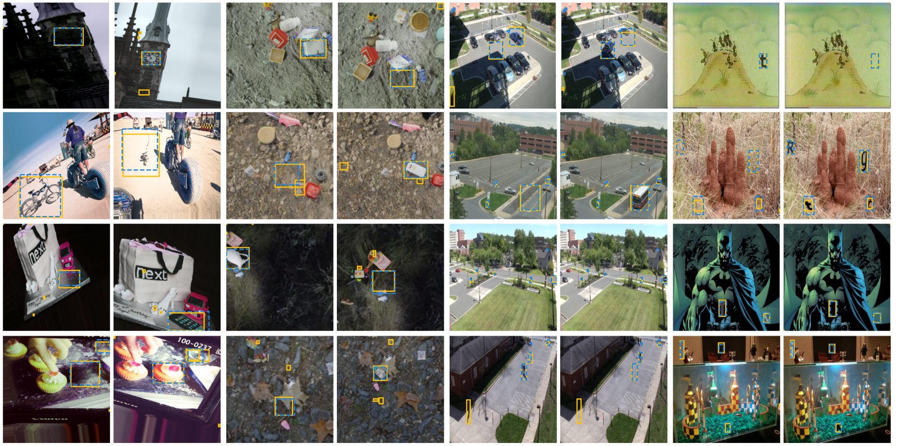

# [The Change You Want to See](https://www.robots.ox.ac.uk/~vgg/research/cyws/)

[[Project Page]](https://www.robots.ox.ac.uk/~vgg/research/cyws/) [[arXiv]](https://arxiv.org/abs/2209.14341)

In Proceedings of the IEEE/CVF Winter Conference on Applications of Computer Vision (WACV) 2023

[Ragav Sachdeva](https://ragavsachdeva.github.io/), [Andrew Zisserman](https://scholar.google.com/citations?hl=en&user=UZ5wscMAAAAJ)



## Datasets

Please use the following to download the datasets presented in this work. The checksums can be found [here](https://thor.robots.ox.ac.uk/~vgg/data/cyws/SHA512SUMS).

### COCO-Inpainted

[Download as .tar](https://thor.robots.ox.ac.uk/~vgg/data/cyws/coco-inpainted.tar)
```
coco_inpainted
└───train
│   │   data_split.pkl
│   │   list_of_indices.npy
│   │
│   └───images_and_masks
│   |   │   <index>.png (original coco image)
│   |   │   <index>_mask<id>.png (mask of inpainted objects)
│   |   │   ...
|   |
│   └───inpainted
│   |   │   <index>_mask<id>.png (inpainted image corresponding to the mask with the same name)
│   |   │   ...
|   |
│   └───metadata
│   |   │   <index>.npy (annotations)
│   |   │   ...
│   
└───test
│   └───small
│   │   |   data_split.pkl
│   │   |   list_of_indices.npy
│   │   └───images_and_masks/
│   │   └───inpainted/
│   │   └───metadata/
│   │   └───test_augmentation/
|   |
│   └───medium/
│   └───large/
```

Note: We deemed it convenient to bundle the inpainted images along with their corresponding (original) COCO images here to allow for a single-click download. Please see [COCO Terms of Use](https://cocodataset.org/#termsofuse).

### Kubric-Change

[Download as .tar](https://thor.robots.ox.ac.uk/~vgg/data/cyws/kubric-change.tar)
```
kubric_change
│   metadata.npy (this is generated automatically the first time you load the dataset)
│   <index>_0.png (image 1)
|   <index>_1.png (image 2)
|   mask_<index>_00000.png (change mask for image 1)
|   mask_<index>_00001.png (change mask for image 2)
|   ...
```

Note: This dataset was generated using [kubric](https://github.com/google-research/kubric).

### VIRAT-STD

[Download original images using link provided by Jhamtani et al.](https://drive.google.com/file/d/1OVb4_3Uec_xbyUk90aWC6LFpKsIOtR7v/view?usp=sharing) + [Download our annotations as .npy.gz](https://thor.robots.ox.ac.uk/~vgg/data/cyws/virat-annotations.npy.gz)


```
std
│   annotations.npy (ours)
│   <index>.png (provided by Jhamtani et al.)
|   <index>_2.png (provided by Jhamtani et al.)
|   ...
```

Note: The work by Jhamtani et al. can be found [here](https://github.com/harsh19/spot-the-diff).

### Synthtext-Change

[Download original bg images as .tar.gz](https://thor.robots.ox.ac.uk/~vgg/data/scenetext/preproc/bg_img.tar.gz) + [Download synthetic text images as .h5.gz](https://thor.robots.ox.ac.uk/~vgg/data/cyws/synthtext-change.h5.gz)

```
synthtext_change
└───bg_imgs/ (original bg images)
|   | ...
│   synthtext-change.h5 (images with synthetic text we generated)

```

Note: The code used to generate this dataset is modified from [here](https://github.com/ankush-me/SynthText).

## Example Usage

Disclaimer - Don't forget to update the `path_to_dataset` in the relevant config files.

Training:

`python main.py --method centernet --gpus 2 --config_file configs/detection_resnet50_3x_coam_layers_affine.yml --max_epochs 200 --decoder_attention scse`

The codebase is heavily tied in with [Pytorch Lightning](https://www.pytorchlightning.ai/) and [Weights and Biases](https://wandb.ai/r). You may find the following flags helpful:

- `--no_logging` (disables logging to weights and biases)
- `--quick_prototype` (runs 1 epoch of train, val and test cycle with 2 batches)
- `--resume_from_checkpoint <path>`
- `--load_weights_from <path>` (initialises the model with these weights)
- `--wandb_id <id>` (for weights and biases)
- `--experiment_name <name>` (for weights and biases)

Testing:

`python main.py --method centernet --gpus 2 --config_file configs/detection_resnet50_3x_coam_layers_affine.yml --decoder_attention scse --test_from_checkpoint <path>`

### Pre-trained model

|       Test pairs      |  COCO-Inpainted  |  Synthtext-Change | VIRAT-STD | Kubric-Change  |
|:--------------------:|:----:|:----:|:----:|:----:|
| [pretrained-resnet50-3x-coam-scSE-affine.ckpt](https://thor.robots.ox.ac.uk/~vgg/data/cyws/pretrained-resnet50-3x-coam-scSE-affine.ckpt.gz) | 0.63 | 0.89 | 0.54 | 0.76

## Citation

```
@InProceedings{Sachdeva_WACV_2023,
    title = {The Change You Want to See},
    author = {Sachdeva, Ragav and Zisserman, Andrew},
    booktitle = {Proceedings of the IEEE/CVF Winter Conference on Applications of Computer Vision (WACV)},
    year = {2023},
}
```
